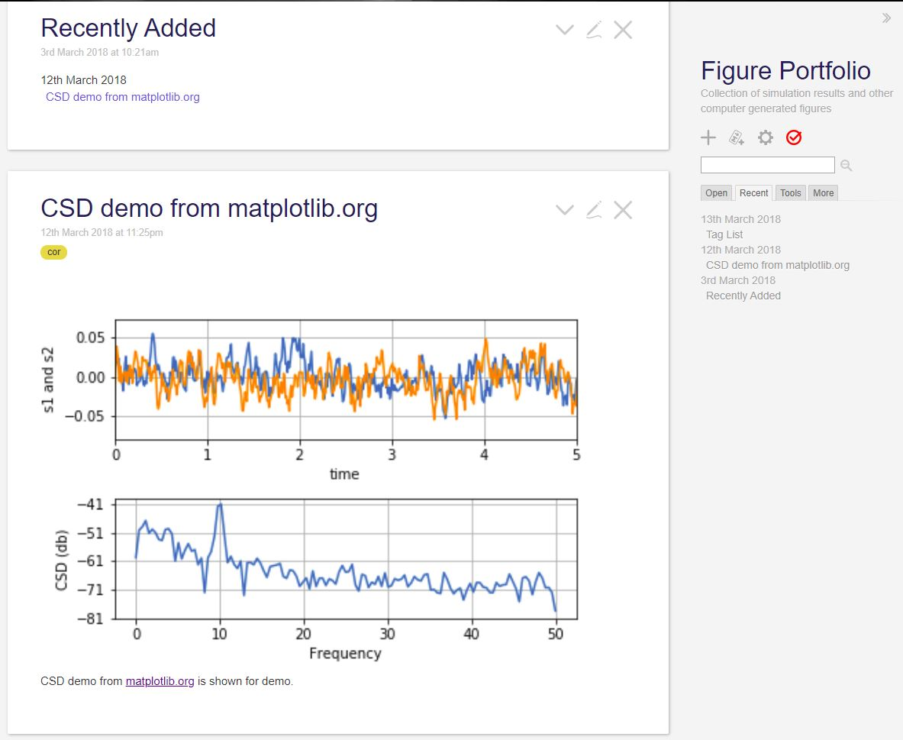

figure portfolio - collect your computer-generated figures and plots in a TiddlyWiki 

- [INSTALLATION](#installation)
- [DESCRIPTION](#description)
- [COMMAND LINE OPTIONS](#command-line-options)
- [MODULE OPTIONS](#module-options)
- [COPYRIGHT](#copyright)

# INSTALLATION

Put the file `figure_portfolio.py` in your current directory or under your `PYTHONPATH`.

# DESCRIPTION
**figure_portfolio** is a python module that adds a *tiddler* in a *TiddlyWiki 5* html file. The tiddler, a micro content in a *TiddlyWiki*, includes markdown links to existing figures, and you can edit the tiddlers after they are added by this module.


    python figure_portfolio.py  -i tw5md_figs.html --title TimeDependency --image "temp_*.png" --tags "cheese"



Figure: Each box is a *tiddler* in the *TiddlyWiki*.

The idea behind this module is that when you do a bunch of numerical experiment, you often get a lot of plots as calculation results. Then you often need to browse them to examine how the calculation went on.  Maybe, you need to keep records on how you generated these plots, what was the parameter used for the calculation, which version of the code was used, and so on.  

The python module **figure_portfolio** is made to help keep track of the plots. The module can be used from command line interface or imported into other python programs as follows: 

```python
import figure_portfolio

#do some calculations and make plots `myfig1` and `myfig2` with matplotlib
images = ["fig1.png", "fig2.png"]
myfig1.figsave(images[0])
myfig2.figsave(images[1])
figure_portfolio.addtiddler(infile='tw5md_figs.html', title='Figs 1-2', image=images,  
    description='Two plots made with some parameter set', tags=['tomato', 'potato'])
```

[Tiddly Wiki](https://tiddlywiki.com/) is "a unique non-linear notebook for capturing, organizing and sharing complex information."  See [A Gentle Guide to TiddlyWiki](https://tiddlywiki.com/#A%20Gentle%20Guide%20to%20TiddlyWiki:%5B%5BA%20Gentle%20Guide%20to%20TiddlyWiki%5D%5D)  for more information. 
There is an add-on to use markdown in the *TiddlyWiki*, and the file  `tw5md_figs.html` already includes that add-on.  So use the file `tw5md_figs.html` as a template for *TiddlyWiki* to use with `figure_portfolio`.  
The *tiddlers* can be searched by its title or tags, enabling systematic comparison of the plots, once you collect the plots in one *TiddlyWiki*.  *TiddlyWiki* is highly customizable.  Read instructions in http://tiddlywiki.com  

# COMMAND-LINE-OPTIONS
    -i htmlfile   Path to input TiddlyWiki file. Required.
    --title TITLE Title for the new Tiddler. Required.
    -o htmlfile   Path to output TiddlyWiki file.  
                  If not specified, the input is overwritten. 
    --description Text to be added below the image 
                  in the tiddler. 
                  Markdown (Maruku flavor) can be used.
    --image       Path to the image file. Wildcard character
                  like "*.png" gets expanded.
    --tags        Quoted space-delimited tags for this tiddler. 
                  Ex: --tags "images temperature depth"

# MODULE-OPTIONS

Set these parameters and call `figure_porfolio.addtiddler()` .

```python
def addtiddler(infile, title, outfile=None, image=None,
    description='', tags='', replace=True):
    """Add a new tiddler to a TiddlyWiki file.

    infile(str): TiddlyWiki file.
    title(str): The title of the new tiddler.
    outfile(str): Output file. Default is the input file.
    image(str or list[str]: The image file(s) to be linked
         from the new tiddler.
    description(str): The text content of the new tiddler
         (mark down text).  Either `image` or `description`
         must have some content at least. 
    tags(str): Tags to be added to the new tiddler. 
         Multiple tag can be one string, 
         `"red, blue triangle"`, 
         or a list `["red", "blue triangle"]`. 
         Alpha numeric + SPC + underscore can be used 
         for the tag.
    replace(boolean): Replace an existing tiddler 
         with the same title (True) or rename the new one
         as 'title-1'(maximum 'title-99').
    """
```


# COPYRIGHT

**figure_portfolio** is released into the public domain by the copyright holders with MIT licence.

This README file was originally written by [Natsuhiko Mizutani](https://github.com/natsuwater) and is likewise released into the public domain.						 
​									 
